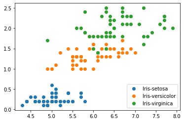
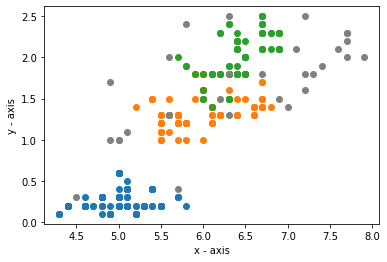

# Clustering Iris Flower Data

Program that utilizes unsupervised learning clustering algorithms (agglomerative clustering and DBSCAN) to build models for identifying the iris flower dataset. 

The image above shows the labeled dataset projected onto a 2D plane. The algorithms I wrote attempt to replicate this using non-labeled data.

## Project Overview
- `clustering_algs.py` contains my code for both the agglomerative clustering and DBSCAN algorithm
- `./data` contains the training data
  - `iris.data` - file containing iris flower dataset
  - `iris.name` - file containing information on how data was gathered and how `iris.data` is organized
- `results_discussion.pdf` contains discussion and analysis of the algorithms implemented in this program

## How to use

- Fork the repository, or download the files, unzip, and open in your code editor.
- Scroll down to my main program and enter the path to the `iris.data` file.
- Further down, there is a PARAMETERS section, where you can change the parameters for both
algorithms. Note that since the data is 4D, we specify two of the four
features to plot in order to visualize the data, which can be adjusted
in the PARAMETERS section as well. See `results_discussion.pdf` for discussion on what parameters yielded the best results. 

## Implementation & Results

I took two different approaches when coding these algorithms in how I stored the data, so I'll explain them here
to aid in understanding my code beyond my code comments.

### Agglomerative clustering

For agglomerative clustering, I used a dictionary to store the data 
points so that I could use the key values to figure out what cluster 
a given point is in when a merge happens. Then, when a point is merged, 
I replace the position where it was in the dictionary with the index of
the cluster where it was just merged to. This way, I can go to any 
given point's index in the dictionary and find which cluster that point
is in by following the dictionary key values. Then at the end, the
dictionary ends up with a few key values with a list of data points
as the values, while the rest are simply set to int indexes. As such,
I can then extract the clusters from this dictionary.

Above is one grouping I was able to get with agglomerative clustering when stopping at three clusters. Noting the size of the orange cluster, we could speculate two of the flower groups are more closely related than the blue cluster, so the model just combined them into one large cluster.

### DBSCAN

In DBSCAN, I used a list index method as I felt using a dictionary added 
some unecessary complexities to the logic. Thus, in my DBSCAN algorithm, 
I instead stored a 1D list of all the data points and simply had my 
algorithm keep track of indices into that list throughout the method. This
way, I could easily check if a given data point was in a cluster by simply
storing clusters as a list of the data points' indices and checking to see
if the given data point's index was in that cluster's list. This concept is
used throughout the algorithm. Then, I could simply use a method to retrieve
the data corresponding to those indices anytime by indexing into the original
data list.

Above is one grouping I was able to get with DBSCAN when plotting the first and fourth features. Note that DBSCAN also allows us to find outliers in addition to clusters. These are denoted in grey. Aside from some of these outliers, these clusters are pretty much the same as our labeled plot above!

As mentioned previously, see `results_discussion.pdf` for further explanation and analysis on these models.

